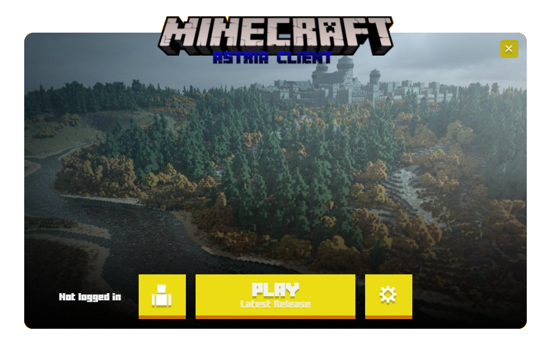

<h1 align="center">Astria Client Alpha 1</h1>

An open-source and lightweight launcher for Minecraft 
<em>Astria Client is <b align="center">under development</b>, come to <a href="https://discord.gg/qM4C48tf">
Discord server
</a> and check the progress</em>
  

<h1>✨ Features</h1>

* 🔒 Easy and secure account management
  * Add multiple Microsoft accounts and easily switch.
  * Does not stores your data.
  * Supports offline mode. `soon`
* 📂 Version control system
  * Launcher updates itself automatically.
* ⚙️ Useful settings to manage launcher
	* Theme system which includes 3 seperate themes.
  * More settings will be added `soon`
* ☕ Automatic Java installer
  * Installs Java for versions that needs different version of Java.
* 🎨 Built in skin library to select from `soon`
* 🏗️ Mod manager to install new mods  `soon`
